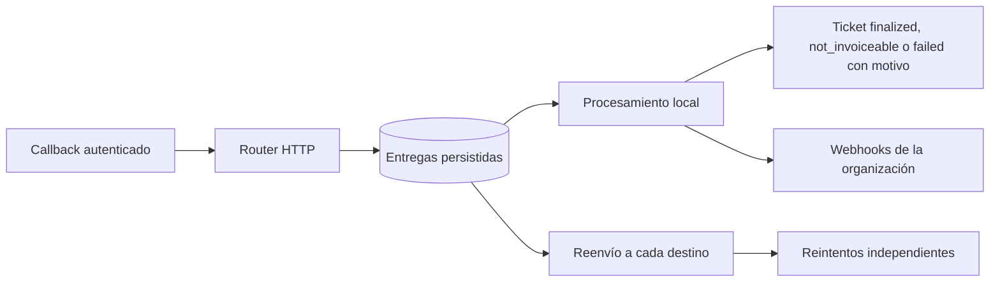

# Webhook router — Node / Render

El router recibe callbacks autenticados, los guarda en PostgreSQL y crea una entrega independiente para el procesamiento local y para cada destino externo. El destino inicial de Vercel está configurado en `render.yaml` y `.env.example`; se pueden agregar más direcciones mediante configuración.

## Recorrido de un evento



1. `POST /api/v1/webhooks/upstream` valida el header configurado y acepta un objeto JSON de hasta 1 MiB.
2. Una única escritura guarda el cuerpo original y todas sus entregas. La respuesta `200 OK` confirma almacenamiento, no que el ticket ya terminó ni que los destinos ya recibieron el evento. El emisor exige exactamente `200`; también se devuelve para reintentos duplicados ya persistidos.
3. El worker ejecuta por separado el procesamiento de tickets, los callbacks locales y los reenvíos. El polling es de 2 segundos por defecto; la carga pendiente puede aumentar la demora.
4. El procesamiento local reutiliza el finalizador existente: éxito → `finalized`; no facturable (`NOT_INVOICEABLE`) → `not_invoiceable`; otros errores → `failed`, con motivo normalizado y eventos de la organización. Un destino externo lento o caído no bloquea este recorrido.
5. Los eventos de progreso se reenvían, pero no finalizan tickets. Un callback terminal cuyo ticket aún no aparece se conserva para reintento. Los eventos que pertenecen a otra aplicación se reenvían aunque no exista un ticket local.

Los rechazos se registran de inmediato con su motivo: `not_invoiceable` para `NOT_INVOICEABLE` y `failed` para otros errores. Los eventos `ticket.failed` e `invoice.failed` se mantienen por compatibilidad; el estado del payload del ticket distingue ambos resultados. Los reintentos de este router son entregas de callbacks; no vuelven a enviar tickets a facturación.

## Servicios y configuración

| Servicio | Responsabilidad | Comando |
| --- | --- | --- |
| `taxo-timbre-webhook-router` | Recibir HTTP y persistir entregas; `GET /health` verifica acceso a la tabla | `pnpm exec tsx worker/webhook-router.ts` |
| `taxo-timbre-worker` | Procesar tickets y consumir entregas locales/externas en loops independientes | `pnpm exec tsx worker/index.ts` |
| `taxo-timbre-web` | Dashboard y API; su endpoint de callbacks comparte la misma autenticación y persistencia | `pnpm start` |

El ingreso se declara como `type: web` porque necesita recibir solicitudes HTTP; el consumidor continúa como `type: worker`. El servidor escucha en `0.0.0.0:$PORT` y usa `/health` como health check. Referencias: [Blueprint de Render](https://render.com/docs/blueprint-spec) y [health checks](https://render.com/docs/health-checks).

| Variable | Uso |
| --- | --- |
| `DATABASE_URL` | La misma base en los tres servicios |
| `UPSTREAM_WEBHOOK_HEADER` | `typeform-signature` |
| `UPSTREAM_WEBHOOK_TOKEN` | Valor privado que debe coincidir exactamente con el header recibido |
| `WEBHOOK_ROUTER_FORWARD_URLS` | Arreglo JSON de URLs HTTPS públicas; `[]` desactiva reenvíos |
| `WORKER_POLL_INTERVAL_MS` | Intervalo del consumidor; por defecto `2000` |
| `PORT` | Puerto del ingreso; Render lo proporciona y el valor local por defecto es `10000` |

El Blueprint toma el token y los destinos desde `taxo-timbre-web` para compartirlos con los otros servicios. El token no está en el repositorio ni en los registros de entregas y debe coincidir con el valor configurado en el emisor.

El consumidor conserva sus variables existentes de almacenamiento, firma de documentos y conexión con el servicio de facturación. El ingreso HTTP solo necesita las variables de la tabla anterior.

Para agregar destinos, edita el arreglo de `WEBHOOK_ROUTER_FORWARD_URLS` y reinicia los servicios. Se admiten hasta 20 URLs únicas. Las nuevas direcciones reciben eventos nuevos; un evento antiguo solo genera la entrega adicional si vuelve a ingresar. Si se elimina un destino, sus entregas pendientes se marcan `failed` con `destination_removed`.

## Contrato de reenvío

Se envía un `POST` con el cuerpo JSON original, sin envolverlo ni modificarlo, y únicamente estos headers:

| Header | Valor |
| --- | --- |
| `content-type` | `application/json` |
| `typeform-signature` | Token configurado; el nombre puede cambiarse con `UPSTREAM_WEBHOOK_HEADER` |
| `idempotency-key` | Identificador estable del evento |
| `x-webhook-event-id` | El mismo identificador |
| `x-webhook-router-hop` | `1`, para detectar bucles |

Todos los destinos configurados reciben el mismo token; por eso deben ser endpoints controlados y autorizados para recibir estos callbacks. No se copian cookies ni headers adicionales del request entrante. No se siguen redirects ni se aceptan destinos privados. El timeout de cada intento HTTP es de 15 segundos. Una respuesta `2xx` completa esa entrega.

La entrega es **al menos una vez**: si un destino procesa el evento y la conexión se corta antes de recibir su respuesta, habrá un reintento. Cada receptor debe deduplicar por `x-webhook-event-id`. El identificador se calcula sobre el contenido JSON normalizado: cambiar espacios u ordenar llaves no crea otro evento; cambiar campos sí. El procesamiento local reutiliza el finalizador actual, cuyos efectos pueden repetirse si el proceso se interrumpe después de escribir el ticket pero antes de completar la entrega.

## Errores y recuperación

| Respuesta del ingreso | Significado |
| --- | --- |
| `200` | Evento persistido; `duplicate: true` significa que todas las entregas ya existían y el reintento queda confirmado |
| `400` | JSON inválido, cuerpo ilegible o valor que no es un objeto |
| `401` | Header de autenticación ausente o incorrecto |
| `405` | Método distinto de POST |
| `409` | Callback con marca de un router previo; se evita un bucle |
| `413` | Cuerpo mayor a 1 MiB |
| `415` | Content-Type distinto de `application/json` |
| `503` | Configuración incompleta, bucle directo o almacenamiento no disponible; no se confirma recepción |

Cada entrega tiene hasta 12 intentos. La espera entre errores crece desde 30 segundos hasta 1 hora; `Retry-After` puede extenderla hasta 24 horas. Una entrega en `running` sin terminar durante 5 minutos puede ser reclamada por otro worker. La actualización final exige el identificador de la reclamación vigente para que un worker anterior no sobrescriba el resultado.

Las entregas agotadas permanecen en `failed`; no se borran ni se reinician por recibir el mismo evento otra vez. Los eventos de otras aplicaciones pueden agotar la entrega local con `ticket_not_found` sin afectar el reenvío. Si el callback solo contiene una clave de idempotencia compartida entre organizaciones, no se adivina qué ticket modificar. Cuando existe un identificador de solicitud del servicio, tiene prioridad.

Para inspeccionar el estado sin imprimir cuerpos o credenciales:

```sql
SELECT id, event_id,
       CASE WHEN destination = 'local' THEN 'local' ELSE 'forward' END AS kind,
       status, attempts, max_attempts, http_status, last_error, run_at, created_at
FROM upstream_webhook_delivery
ORDER BY created_at DESC
LIMIT 100;
```

Para volver a intentar **una entrega fallida específica** después de corregir su causa, usa una consulta parametrizada desde una herramienta administrativa; `$1` debe ser su UUID:

```sql
UPDATE upstream_webhook_delivery
SET status = 'pending', attempts = 0, run_at = now(),
    locked_at = NULL, locked_by = NULL, last_error = NULL
WHERE id = $1 AND status = 'failed';
```

La retención de cuerpos y la alerta operativa de entregas agotadas no están automatizadas en este cambio. La tabla conserva payloads originales para recuperación; su acceso es administrativo y no se publica en la API de clientes.

## Activación

1. Configura el token confirmado en `UPSTREAM_WEBHOOK_TOKEN` de Render y revisa los destinos. No incluyas el token en archivos versionados.
2. Crea la tabla del router **antes** de activar el nuevo ingreso. La instalación actual administra el esquema con `pnpm db:push`, que se conserva como predeploy del web principal. Su historial de migraciones está vacío: no cambies a `db:migrate` sin establecer primero el baseline. En instalaciones con historial de migraciones establecido, aplica `0008_webhook_router.sql` mediante `pnpm db:migrate`. Coordina el primer despliegue para que termine la actualización del esquema antes de cambiar el callback.
3. Despliega el web principal, el worker y el nuevo servicio HTTP con `render.yaml`. Si el web principal se aloja fuera de ese Blueprint, configura manualmente las mismas variables y sustituye las referencias `fromService` según corresponda.
4. Verifica `GET /health` en el nuevo servicio y confirma que `taxo-timbre-worker` está activo. El health check del ingreso no certifica que el consumidor esté corriendo.
5. Configura el callback emisor como `https://<host-del-router>/api/v1/webhooks/upstream`, con el header `typeform-signature`. La URL de Vercel proporcionada es un **destino de reenvío**, no la dirección del nuevo ingreso.
6. Comprueba un evento de prueba: `200`, una entrega local y una por destino; después, ticket en estado final y entregas completadas o errores identificables. No basta con revisar el `200`.

En local: `pnpm webhook-router` y `pnpm worker`, en terminales separadas, con una base de desarrollo. No se han enviado callbacks de prueba al destino de producción ni se ha desplegado este cambio.

## Verificación automatizada

`pnpm test` cubre autenticación, validación, preservación de cuerpos, reenvío y configuración. `lib/webhook-router/router.integration.test.ts` usa PostgreSQL real para verificar finalización, rechazo con motivo, deduplicación concurrente, aislamiento por organización, reintentos, leases y el servidor HTTP.

La integración solo se activa con `WEBHOOK_ROUTER_TEST_DATABASE_URL` apuntando a una base local desechable llamada `webhook_router_test`. Inicializa el esquema con Drizzle en esa base, y ejecuta el test con esa URL; el test vuelve a crear la tabla del router con la migración real y limpia sus fixtures. Nunca lo ejecutes sobre datos que quieras conservar.

```sh
DATABASE_URL="$WEBHOOK_ROUTER_TEST_DATABASE_URL" pnpm exec drizzle-kit push --force
DATABASE_URL="$WEBHOOK_ROUTER_TEST_DATABASE_URL" pnpm exec vitest run lib/webhook-router/router.integration.test.ts
```
